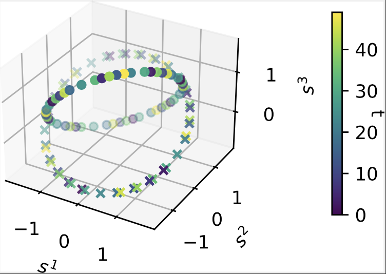

# Code to reproduce the ICML Paper : "_How do Transformers Perform In-Context Autoregressive Learning?_"




## Compat

This package has been developed and tested with `python3.11`. It is therefore not guaranteed to work with earlier versions of python.

## Reproducing the experiments/figures of the paper

### Experiment in Figure 3 - Illustration of the theoretical results

To reproduce the left-hand part of the figure: 

```bash
python unitary.py
```

To reproduce the right-hand part of the figure (this one might be slow):  

```bash
python orthogonal.py
```

Plots are in the folder figures.

### Experiment in Figure 4 - Histograms

To reproduce the figure:

```bash
python validation_token_encoding.py
```

The Histogram is in the folder figures.

### Experiment in Figure 5 - Augmented setting

To train the same model with the same setup, you can use the script in augmented.py

### Experiment in Figure 7 - Non-Augmented setting

To train the same model with the same setup, you can use the script in non_augmented.py

### Experiment in Figure 6 - Positional Encoding Attention Only

To reproduce the figure:

```bash
python pe_only.py
```

The plots are in the folder figures.


Cite
----

If you use this code in your project, please cite::

Sander, M. E., Giryes, R., Suzuki, T., Blondel, M., & Peyré, G. 
How do Transformers Perform In-Context Autoregressive Learning?. 
In Forty-first International Conference on Machine Learning.
https://arxiv.org/abs/2402.05787
